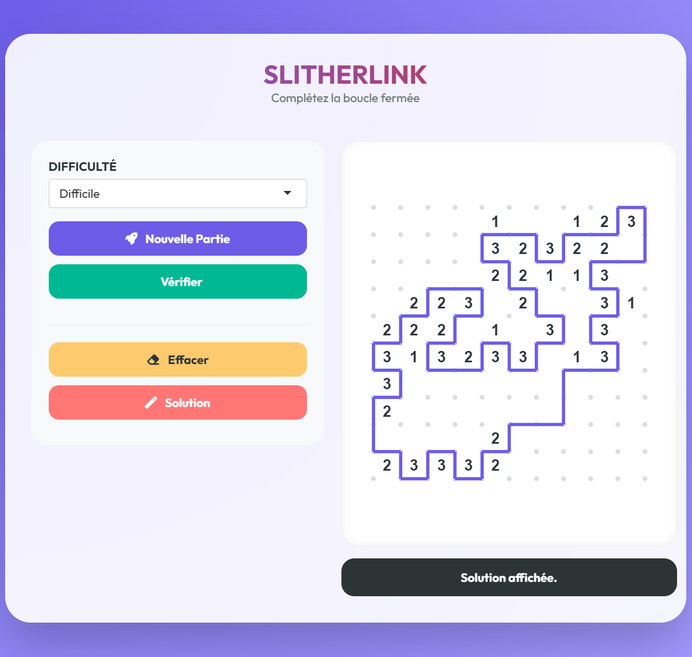

# slitherlinkR 

## Présentation du Projet
**Projet de programmation R – Université de Montpellier** 
**Encadrant :** Jean-Michel Marin  

Ce projet consiste à développer un package R complet ainsi qu’une application Shiny interactive pour le jeu de logique **Slitherlink**.

---

##  Groupe 5
- **Hadjer Benaissa**
- **Myriam El-Idrissi**

---

##  Objectifs
L’objectif de ce projet était de :
- Concevoir un **package R** structuré et documenté.
- Implémenter la **logique algorithmique** du Slitherlink (génération de boucle aléatoire, calcul d'indices et vérification de validité).
- Développer une **interface Shiny**.
- Proposer une expérience de jeu fluide avec différents niveaux de difficulté.

---

##  Règles du Jeu Slitherlink
Le Slitherlink est un puzzle logique se jouant sur une grille de points. Le but est de relier des points voisins pour former une **unique boucle fermée** :
- Les nombres (0 à 3) indiquent combien de segments entourent la case.
- La boucle ne doit jamais se croiser ni se ramifier.
- À la fin, tous les segments tracés doivent être connectés pour former un seul chemin fermé.

---

##  Fonctionnement de l’Application
L’interface utilisateur est conçue pour être simple et réactive. Voici les étapes et outils disponibles pour le joueur :

###  Déroulement d'une partie
1. **Choisir le niveau** : Sélectionnez la difficulté via le menu déroulant (Facile, Moyen, Difficile, Expert). Cela ajuste la taille de la grille le nombre d'indices visibles et la forme de la boucle (simple vs complexe).
2. **Lancer le jeu** : Cliquez sur le bouton **"Nouvelle partie"** pour générer une grille aléatoire.
3. **Tracer la boucle** : Cliquez directement sur les segments entre les points pour les activer (noir) ou les désactiver.

###  Barre d'outils (Boutons)
* **Nouvelle partie** : Génère un nouveau puzzle basé sur le niveau de difficulté choisi.
* **Vérifier** : Analyse instantanément si votre tracé respecte les indices numériques et s'il forme une boucle unique et fermée. Elle nous indique si la partie est gagnée.
* **Effacer** : Réinitialise votre tracé actuel pour recommencer la grille de zéro.
* **Solution** : Affiche la réponse correcte si vous êtes bloqué (tous les segments de la boucle apparaissent).

---

---

## 🖼️ Aperçu du jeu

Voici un aperçu de l'interface interactive de **slitherlinkR** en action :

<p align="center">
  
  <br>
  <em>Interface de jeu générant une grille avec les outils de vérification.</em>
</p>

---
---

##  Structure du Projet
Le projet respecte l'arborescence standard d'un package R :

* **`R/`** : Logique interne du package.
    * `create_game.R` : Génération de la boucle et de la grille.
    * `get_clues.R` : Calcul des indices (0-3) à partir de la boucle.
    * `is_solved.R` : Algorithme de vérification de la solution.
* **`inst/shiny/`** : Code source de l'application interactive (`app.R`).
* **`DESCRIPTION`** : Métadonnées du package, auteurs et dépendances (Shiny).
* **`NAMESPACE`** : Déclaration des fonctions exportées.
* **`slitherlinkR.Rproj`** : Fichier de configuration RStudio.
* **`README.md`** : Présentation du projet et instructions.

---


---


##  Lancer l’application

Pour lancer le jeu Slitherlink, exécutez la commande suivante dans la console R :

```r
shiny::runApp("inst/shiny")
